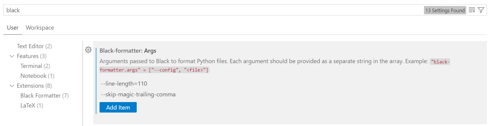
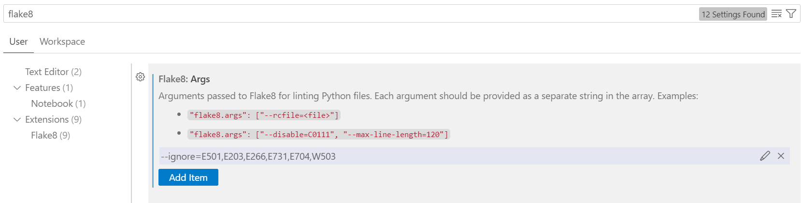

# Latent Cot RL

Updates on progress and full experiment logs: [Feishu Doc](https://ewtmzxnm3yv.feishu.cn/docx/R54idp6thoky0ixDXVdc0nZ5nah)

## Introduction

R1 paradigm is a huge success, yet it often has the "overthinking" problem. Latent reasoning (COCONUT, 2024) is a potential solution. With stronger representation capability, latent tokens can significantly reduce the length of CoT and yields better performance. R1's cot-free supervision matches perfectly with latent reasoning.
To achieve latent reasoning, the training is divided into 2 stages:

1. Cold start: the model learns the format and develops the basic latent reasoning capability. It should determine how many latent tokens to output before responding with the final answer.
2. RL: by disturbing the reasoning chain, multiple cots are sourced. GRPO algorithms can be applied to optimize the model.
3. For disturbance: add noise on the hidden states or logits distribution
4. For calculating loss: instead of logprobs for explicit tokens, we can use metrics such as KL-div on the logits distribution or l_p norm for latent states

First we try the method on GSM8k and countdown, and then we expand it to more tasks.

## Installation

```bash
pip install -r requirements.txt
```

## sft
just run
```
bash scripts/sft.sh
```
default model is qwen3-1.7b-base and dataset is countdown.

## coco

#### gpt2 coco (static)

sft:

```bash
python -m train.coco --model /home/nfs02/model/gpt2-xl --gradient_accumulation_steps 1 --run_name sft-gsm8k-gpt2-coco --data_mixing_ratio 0 --report_to none --learning_rate 1e-4 --per_device_train_batch_size 16 --sft_latent_supervision coco --warmup_ratio 0 --gsm8k_cot_content formula --coco_num_latent_per_step 2 --force_latent_model gpt2 --template plain --latent_type dynamic --cot_type none --max_stages 3 --stage_epochs 6 3^4
```

eval:

```bash
for step in 0 1 2 3 4; do python -m tools.eval --model outputs/sft-gsm8k-gpt2-coco_stage_$step --dataset_name gsm8k --sft_latent_supervision coco --gsm8k_cot_content formula --coco_current_step $step --template plain --latent_type dynamic --current_step $step --max_latent_len $(( step * 2 )); done
```

## soft thinking & sampling strategy

### evaluation

#### eval soft thinking

Entropy-length termination:

```bash
for entropy in 0.01 0.05 0.1 0.2; do python -m tools.eval --model /home/xingsy/data_91/model/Qwen3-1.7B --dataset_name gsm8k --gsm8k_cot_content sentence --cot_type plain --latent_marker think --add_start_latent_marker --end_latent_max_prob false --end_latent_entropy_threshold $entropy --end_latent_low_entropy_len 64 --hs_processor embedding --hs_processor_top_p 0.95 --hs_processor_temperature 1  --do_sample --temperature 0.6 --top_k 20 --top_p 0.95 --force_latent_model qwen3 --max_latent_len 800 --max_new_tokens 1024 --score_file scores-64.csv --n_gpus 8 --generate_batch_size 16; done
```

End-token termination:

```bash
python -m tools.eval --model /home/xingsy/data_91/model/Qwen3-1.7B --eval_dataset countdown --cot_type plain --latent_marker think --add_start_latent_marker --hs_processor embedding --hs_processor_top_p 0.95 --hs_processor_temperature 1 --do_sample --temperature 0.6 --top_k 20 --top_p 0.95 --force_latent_model qwen3 --max_latent_len 7500 --max_new_tokens 8192 --n_gpus 8 --generate_batch_size 16
```

#### eval explicit cot

```bash
python -m tools.eval --model /home/xingsy/data_91/model/Qwen3-1.7B --eval_dataset aime --do_sample --temperature 0.6 --top_k 20 --top_p 0.95 --cot_type plain --max_think_tokens 7500 --max_new_tokens 8192 --enable_latent false [--system_prompt_type none] --n_gpus 8 --generate_batch_size 16
```

#### case

for latent model:

```bash
python -m tools.case --model /home/xingsy/data_91/model/Qwen3-1.7B --eval_dataset countdown --cot_type plain --latent_marker think --add_start_latent_marker --hs_processor embedding --hs_processor_top_p 0.95 --hs_processor_temperature 1 --do_sample --temperature 0.6 --top_k 20 --top_p 0.95 --force_latent_model qwen3 --max_latent_len 7500 --max_new_tokens 8192 --start_pos [n]
```

for key-token tree search model:
```bash
python -m pdb -m tools.case --model /home/xingsy/data_91/model/Qwen3-1.7B --eval_dataset countdown --do_sample --temperature 0.6 --top_k 20 --top_p 0.95 --cot_type plain --max_new_tokens 7000 --enable_latent false --force_key_token_model qwen3 --model_filter_path outputs/diverge --model_filter_thres 0.3 --num_return_sequences 16
```


### rl

#### rl on soft think

Run trl trainer:

```bash
python scripts/trl.py --gpu_ids 0 1 2 3 4 5 6 7 --per_device_train_batch_size 1 --per_device_eval_batch_size 30 --num_generations 8 --gradient_accumulation_steps 16 --dataset_name aime --model Qwen/Qwen3-1.7B --force_latent_model qwen3 --max_completion_length 7000 --max_latent_len 6000 --add_start_latent_marker --latent_marker think --hs_processor embedding --latent_loss_type l2 --latent_loss_weight 1e4 --latent_state_disturb_type embedding --latent_state_disturb_strength 0.05 --latent_state_disturb_entropy_threshold 1.2 --max_disturb_ratio 0.05 --entropy_loss_ratio 0.05 --eval_steps 5 --save_steps 10 --n_eval_samples 30 --run_name qwen3-aime [--continue_training]
```

> Notes on disturb_entropy_threshold (temperature = 1, strength = 0.05): 
>
> For reasoning model (deepseek-distill, qwen3) on aime:
> - 0.1: 30% of the tokens are disturbed
> - 0.5: 15% of the tokens are disturbed
> - 0.7: 7.5% of the tokens are disturbed
> - 0.8: 5% of the tokens are disturbed
> - 1.0: 2% of the tokens are disturbed
>
> For qwen2.5 on countdown:
> - 1.0: 20% of the tokens are disturbed
> - 1.2: 5% of the tokens are disturbed
> - 1.5: 2.5% of the tokens are disturbed

with qwen2.5 think token as "<<"">>":

```bash
python scripts/trl.py --gpu_ids 0 1 2 3 4 5 6 7 --per_device_train_batch_size 1 --per_device_eval_batch_size 30 --num_generations 8 --gradient_accumulation_steps 32 --dataset_name countdown --model Qwen/Qwen2.5-3B-Instruct --force_latent_model qwen2 --max_completion_length 3000 --max_latent_len 2900 --add_start_latent_marker --plain_cot_start_marker "<<" --plain_cot_end_marker ">>" --start_latent_marker "<<" --end_latent_marker ">>" --hs_processor embedding --latent_loss_type l1 --latent_loss_weight 1e2 --latent_state_disturb_type embedding --latent_state_disturb_strength 0.05 --latent_state_disturb_entropy_threshold 1.1 --max_disturb_ratio 0.1 --entropy_loss_ratio 1 --eval_steps 5 --save_steps 10 --n_eval_samples 30 --run_name qwen2.5-3B-countdown --response_think_reward 0.1 --answer_len_reward 0.1 --answer_no_think_reward 0 --data_seed 10
```

for debugging:

```bash
python -m pdb -m train.grpo --per_device_train_batch_size 2 --per_device_eval_batch_size 2 --num_generations 2 --dataset_name aime --model Qwen/Qwen3-1.7B --force_latent_model qwen3 --max_completion_length 8000 --max_latent_len 7000 --add_start_latent_marker --latent_marker think --hs_processor embedding --latent_loss_type l2 --latent_loss_weight 1e4 --latent_state_disturb_type embedding --latent_state_disturb_strength 0.03 --latent_state_disturb_entropy_threshold 0.8 --max_disturb_ratio 0.05 --entropy_loss_ratio 0.05 --run_name test --report_to none
```

#### explicit cot rl

```bash
python scripts/trl.py --gpu_ids 0 1 2 3 4 5 6 7 --per_device_train_batch_size 1 --per_device_eval_batch_size 1 --num_generations 8 --dataset_name countdown --model /home/xingsy/data_91/model/Qwen3-1.7B --enable_latent false --max_completion_length 8192
```

## the divergence model

### data

```bash
python -m data.diverge --model /home/nfs04/model/Qwen2.5/Qwen2.5-1.5B-Instruct --dataset_name countdown --do_sample --temperature 0.6 --top_k 20 --top_p 0.95 --cot_type plain --max_new_tokens 1000 --enable_latent false --force_key_token_model qwen2 --num_return_sequences 32 --n_train_samples 9024 --start_pos 8000 --n_gpus 8
```

### train

```bash
python -m train.diverge --load_path /home/xingsy/data_91/model/Qwen3-Embedding-0.6B --per_device_train_batch_size 32 --learning_rate 1e-5 --run_name divergence-train
```

### eval

# Contributing

Fork and open a pull request. Follow the instructions below or your PR will fail.

1. **Static linting.** Use *Pylance* (basic level) to lint your code while doing your work. Please also fix all warnings. Refer to https://docs.pydantic.dev/latest/integrations/visual_studio_code/#configure-vs-code to configure your VSCode. NOTE: Be cautious of using `# type: ignore` to suppress type errors, as you may be ignoring valuable traces of bugs; usually typing.cast() is more preferred. If you want to add external modules which will not pass the linter, you can add them to `pyrightconfig.json`.
2. **Code formatting.** Config your vscode to use *black* to do code formatting. The arguments are supposed to be:
   
   If you do not like this code style or you cannot complete the config, you can also use command line to format your code before opening a PR:
   ```shell
   pip install black==24.10.0
   black . --skip-magic-trailing-comma --line-length 110
   ```
3. **Import sorting.** Install *isort* extension in your vscode and run `isort` to sort your imports automatically, or run this before opening a PR:
   ```shell
   pip install isort==6.0.1
   isort . --profile black  --line-length 110
   ```
4. **Code style checking.** Config your vscode to use *flake8* to check your code style. The arguments are supposed to be:
   
   If you do not like this code style or you cannot complete the config, you can also use command line to check your code style before opening a PR:
   ```shell
   pip install flake8==7.2.0
   flake8 . --ignore=E501,E203,E266,E731,E704,W503
   ```