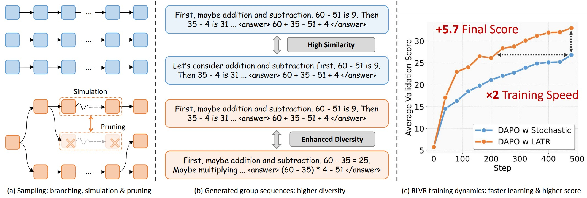

# Lookahead Tree-Based Rollouts for RLVR

This is the official implementation of the paper _Lookahead Tree-Based Rollouts for Enhanced Trajectory-Level Exploration in Reinforcement Learning with Verifiable Rewards_.



## Installation

```bash
pip install -r requirements.txt
```

## Run RL

### Data

Please directly download the dataset from [here](https://huggingface.co/datasets/starreeze/latr-data) and put the two directories (countdown-base, math-base) in `dataset/`.

If you want to generate the dataset yourself, please refer to `data/verl_gen.py`:

```bash
python -m data.verl_gen --dataset NAME --src SRC --dst DST --template_type TEMPLATE_TYPE
```

- name: the dataset name. Support `countdown`, `amc23`, `math500`, `math_dapo`, `olympiad`, default to `countdown`
- src: the source dataset name or a local path, default to `Jiayi-Pan/Countdown-Tasks-3to4`
- dst: the destination path to save the verl-ready dataset, default to `dataset/countdown`
- template_type: the template type, currently only support `base`

### Training

We implement on the standard VeRL-0.5.0 framework. Training scripts are provided in `scripts`, with names organized as `{algorithm}-{rollout}-{dataset}.sh`. For rollout name, `vllm` represents stochastic sampling, and `kt` represents looKahead Tree-based rollouts (LATR).

The `kt` scripts differ from `vllm` only in `actor_rollout_ref.rollout.name` (which calls different rollout workers in `verl/workers/rollout`) and additional kt arguments (those starting with `actor_rollout_ref.rollout.kt`), including:

- `max_n_branch_per_token`: only top-m tokens are considered when branching
- `prob_filter_abs_thres`: $\tau*{abs}$ in the paper
- `prob_filter_rel_thres`: $\tau*{rel}$
- `rollout_filter_edit_dist_thres`: $\tau*{ed}$
- `rollout_filter_steps`: $r$
- `mix_ratio_schedule`: a dict of {training_step: $\eta$}, generally exponential decay but more flexible
- `return_nb_thres_decay`/`force_return_step`: control the generation step to exit LATR and use stochastic sampling instead

### Evaluation

We also use the VeRL framework for evaluation. Results can be obtained in two ways:

1. At the last stage of training, evaluation is triggered automatically. The results are printed to the console and logged to both a log file and wandb.
2. With VeRL checkpoints, you can run evaluation scripts provided in `scripts`, with names organized as `eval-{dataset}.sh`. Just use `bash scripts/eval-{dataset}.sh EXPERIMENT_NAME` to evaluate. The results are printed to the console and logged to a file in `outputs/eval/EXPERIMENT_NAME`.

To obtain a csv from log files, use `python tools/read_log.py --path path/to/log/files.log`. The csv will be saved in `./metrics.csv`.

## Implementation Details

### Overview

We propose a new rollout method LATR higher diversity. Generally, it is orthogonal to the policy update, so the workflow is the same as the original VeRL. The only difference is the rollout worker.

We implement the rollout worker in `verl/workers/rollout/kt_rollout.py`, replacing the original `hf_rollout.py`. The worker reads the rollout config and pass it to the `generate` method in `model/generation.py`, where the core sampling logic is implemented.

### Code Structure

```
data/                # data processing and reward function
model/               # core sampling logic
├── generation.py    # the generate method
├── metrics.py       # metrics for pruning (edit distance, suffix match, rouge-l)
└── sample_filter.py # the filters for both branching and pruning
tools/               # utility functions
verl/                # the verl framework (with our modifications)
```

### Modifications to VeRL

We modify the VeRL framework to support our rollout method, majorly including:

- `verl/trainer/ppo/metric_utils.py:process_validation_metrics()`: add response length as a validation metric.
- `verl/trainer/ppo/ray_trainer.py:l1195-1199,l1239-1253`: implement logic for diversity filtering in ablation study.
- `verl/trainer/constants_ppo.py`: the runtime environment for PPO training, which is modified to set the `RAY_DEBUG` environment variable to `1` to enable the debug mode.
- `verl/trainer/main_ppo.py:l205-208`: inject reward function for countdown since there's no built-in ones.
- `verl/workers/fsdp_workers.py:l127`: add timeout to the distributed initialization.
- `verl/workers/fsdp_workers.py:l499-506`: the worker initialization, which is modified to initialize our own rollout worker when `rollout.name` is `kt`.
- `verl/workers/rollout/kt_rollout.py`: the rollout worker, which is a subclass of `BaseRollout` in `verl/workers/rollout/base.py`. The worker reads the rollout config and pass it to the `generate` method in `model/generation.py`, where the core sampling logic is implemented.

## Citation

If you find this useful, please consider citing:

```bibtex
...
```

## Acknowledgments

We thank the authors of the following projects for their contributions:

- [VeRL](https://github.com/volcengine/verl)
- [Qwen](https://github.com/QwenLM/Qwen3)
- [TinyZero](https://github.com/Jiayi-Pan/TinyZero)